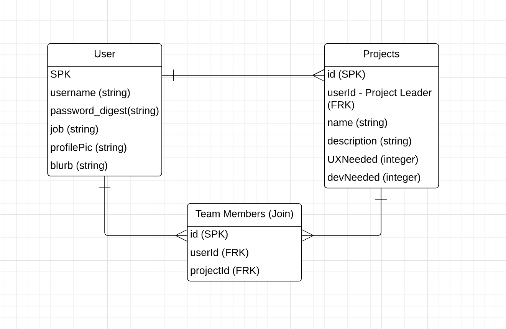

# SOURC

## Description

A friendly experience for new or aged programmers and UX designers who can collaborate on a small or big project in a specific time frame. Programmers and designers can get in there reps and try on different challenges, both sides can get a better understanding on what each role does during a project and can also build on teamworking skills... Or just have fun hacking along.

---

## Features

- Create account
- Choose your role (SE/UX)
- Create projects you want to work on, with a timeframe
- Project is displayed on your account and on the main page
- Apply to projects with a form button and submit your email and slack username

--- 

##ERD

This ERD represents the MVP relationships between our databases

---

## API endpoints

'/users' : Displays all users, could be useful if we implement a user search.

'/projects' : Displays all projects, could be searched with queries.

'/users/:id' : Displays one user, used to view profiles.

'users/:id/projects' : Shows all projects belonging to user

'users/:id/projects/:projectId': Shows single project in detail

'users/:id/projects/:projectId/members: Shows the members (and leader) of a project

---

## WireFrame

## Group Logo

